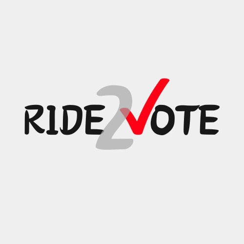

# Ride2Vote

Ride2Vote is a web application designed to strengthen voting by ensuring everyone has access to their polling location. We connect voters who need transportation with volunteer drivers in their community.

---
## Inspiration

In 2020, we met Sarah, an elderly voter from rural Georgia. Despite her unwavering desire to participate in voting, she faced a significant challenge: living 15 miles from her polling station with no transportation options. Her story isn't unique – millions of Americans face similar barriers to voting.

That's when Ride2Vote was born.

What started as a small group of volunteers offering rides to local polling stations has evolved into a nationwide movement. Today, Ride2Vote connects thousands of volunteer drivers with voters who need transportation, ensuring that distance never stands between a citizen and their right to vote.

---
## What it Does
Ride2Vote connects voters who need rides to polling stations with volunteer drivers in their community, making democratic participation accessible to everyone.

### For Voters
- **Easy Ride Requests**: Simple form to request transportation to polling locations
- **Accessibility Options**: Specify special needs like wheelchair access or assistance
- **Flexible Scheduling**: Choose your preferred voting time
- **Real-time Updates**: Stay informed about your ride status

### For Volunteer Drivers
- **Driver Registration**: Quick sign-up process with vehicle and availability details
- **Ride Management**: Accept and manage ride requests
- **Impact Tracking**: Monitor your contribution through the leaderboard
- **Accessibility Specifications**: Indicate the types of assistance you can provide

### Platform Features
- **Interactive Dashboard**: Clean, user-friendly interface
- **Leaderboard System**: Recognition for active volunteer drivers
- **Quiz Section**: Educational content about voting rights and procedures
- **Secure Authentication**: Protected user data and privacy
- **Responsive Design**: Seamless experience across all devices

---
## How We Built It 🚀

We developed **Ride2Vote** using **React.js** for a dynamic, responsive frontend, ensuring an easy-to-use interface for both voters and volunteer drivers. **React Router DOM** handled navigation, while **Framer Motion** added smooth animations for a polished experience. We used **React Icons** and **custom CSS** to keep the design modern and accessible.

For secure user authentication, we integrated **Auth0**, allowing both riders and drivers to register and log in easily. Drivers can register their vehicle info, specify accessibility preferences, and track their impact through a **leaderboard system**. Riders can quickly request rides and customize their preferences, with **real-time driver matching**.

We also built an interactive **Voting Knowledge Quiz** to educate users about the election process and boost engagement.

### Tech Stack 🛠️
- **Frontend**: React.js, React Router DOM, Framer Motion, React Icons, Custom CSS
- **Authentication**: Auth0
- **Real-Time Chat**: WebSockets
- **Backend**: Firebase
- **Deployment**: Netlify

This tech stack helped us create a seamless platform that connects voters with volunteer drivers, ensuring access to polling stations and empowering young voters nationwide.

---
## Challenges We Ran Into

During development, we encountered a few challenges that helped refine our approach:

- **Privacy and Security of Data**: Ensuring the security of sensitive user information, such as health reports and product preferences.
- **Efficient Data Handling**: Organizing large datasets to provide quick, actionable sustainability insights.
- **Scalability**: Designing the system to handle increasing user traffic and real-time queries.
- **Community Engagement**: Encouraging active participation in the DIY repurposing feature while maintaining high-quality contributions.

These challenges drove us to innovate and deliver a solid, user-centric platform.

---

## Accomplishments We're Proud Of

We are proud to have built ECo-nnect, a platform that:

- Tackles both environmental sustainability and personal health.
- Empowers individuals to make eco-conscious choices easily.
- Introduces exciting features like Eco Shopping Assistant, DIY Repurposing Ideas, and Health Integration.
- Inspires collective action, showing that small steps can lead to significant positive changes for the planet.

ECo-nnect is helping create a more eco-friendly future for everyone.

---

## What We Learned

Through the development of ECo-nnect, we learned that:

- Sustainability is not just about eco-friendly products, but about creating a balanced lifestyle that nurtures both personal health and the environment.
- Even the smallest, repetitive actions, when combined, can result in huge, collective impact.
- Empowering individuals with the right tools and knowledge can lead to meaningful change and a better future for the planet.

---

## What's Next for ECo-nnect

Looking ahead, we have several exciting features and plans:

- **Feature Development**: AI-powered personalized recommendations for sustainable products and DIY ideas based on personal lifestyle.
- **Community Development**: A gamified reward system for sharing repurposing ideas and tracking collective environmental impact.
- **Global Reach**: Expanding the platform to include localized sustainability data for users worldwide.
- **Educational Integration**: Partnering with schools and organizations to integrate ECo-nnect into sustainability education.
- **Real-time Insights**: Adding dashboards that track how users’ actions are reducing carbon footprints and waste globally.

Together, we can make the world a better place, one choice at a time. Join us in turning small actions into big changes for the environment. The future is green, and it starts with ECo-nnect!

---

## Contributors

Introducing the minds behind ECo-nnect's mission for a sustainable future!

**
Ahamad Mamun Nishar Miya
**
   

     
   

   

     
     
   

**
Aastika Banstola
**
   

     
   

   

     
     
   

<a href="#readme-top">↑ Back to Top ↑</a>

*
Empowering eco-friendly choices for a greener tomorrow.
*
